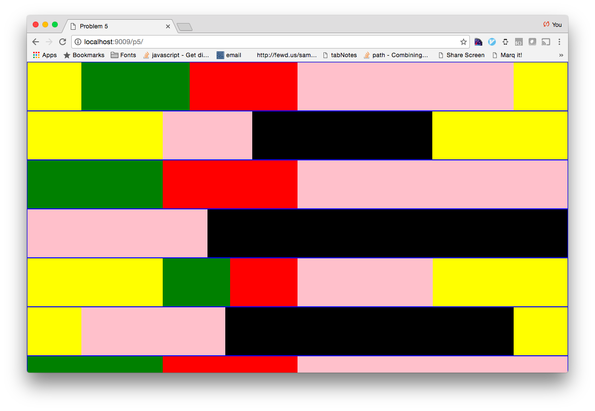

# Problme 5

Create a layout the looks similar to the image below.

HINT: the blue borders should offer a clue about how the HTML is structured

Do not worry about making the layout be full hieght of the page, as you know, the height of this layout will be driven by the content itself. 
